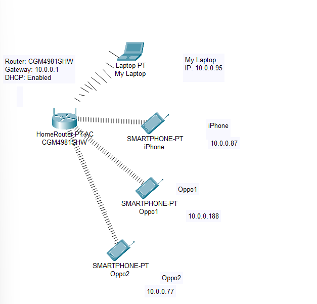

#  Home Network Documentation

This document describes the design of a home Wi-Fi network including physical and logical topologies, device information, IP addressing, and configuration management.

---

##  1. Physical Topology

The following diagram shows the physical layout of the devices in the apartment.

- The router is located in the **living room**.
- The **laptop** and **iPhone** are on the desk in the **bedroom**.
- The two **Oppo phones** are on the **bedside** and **bed foot** in the same room.

---

##  2. Logical Network Topology

All devices connect to the ISP-provided wireless router (CGM4981SHW), which acts as the default gateway and DHCP server.

---

##  3. Device Addressing

| Device Name  | MAC Address         | IP Address   | Connection Type | DHCP | Location           |
|--------------|----------------------|--------------|------------------|------|---------------------|
| My Laptop    | 00-88-E8-E7-B8-EE    | 10.0.0.95    | Wi-Fi            | Yes  | Bedroom (desk)      |
| iPhone       | --                   | 10.0.0.87    | Wi-Fi            | Yes  | Bedroom (desk)      |
| Oppo Phone 1 | --                   | 10.0.0.188   | Wi-Fi            | Yes  | Bedroom (bedside)   |
| Oppo Phone 2 | --                   | 10.0.0.77    | Wi-Fi            | Yes  | Bedroom (bed foot)  |

---

##  4. Configuration & Credential Management

- The router (CGM4981SHW) provides both 2.4GHz and 5GHz wireless access.
- DHCP and DNS are enabled by default.
- Login credentials are securely written on paper.
- No configuration changes were made from the default ISP setup.
- User understands how to access the admin panel via `10.0.0.1`.

---

##  Notes

- MAC and IP addresses reflect real but internal network information.
- This documentation was created for a school networking assignment.

**Network Concepts Used:**
- **DHCP (Dynamic Host Configuration Protocol):** Automatically assigns IP addresses to devices.
- **NAT (Network Address Translation):** Allows multiple devices in a private network to share a single public IP.
- **SSID (Service Set Identifier):** The Wi-Fi network name.
- **Default Gateway:** The device (router) that routes traffic from local devices to the internet.
**Methods Used to Collect Network Info:**
- Used `ipconfig /all` on Windows to find IP, MAC, DNS, and DHCP settings.
- Checked router labels for SSID and login credentials.
- Manually surveyed physical locations of devices in the apartment.

## Conclusion

This home network setup demonstrates a simple but functional wireless configuration using private IPv4 addressing, dynamic IP allocation via DHCP, and secure credential storage. It fulfills all core requirements of a home WLAN environment and shows the student’s understanding of basic network administration tasks.

